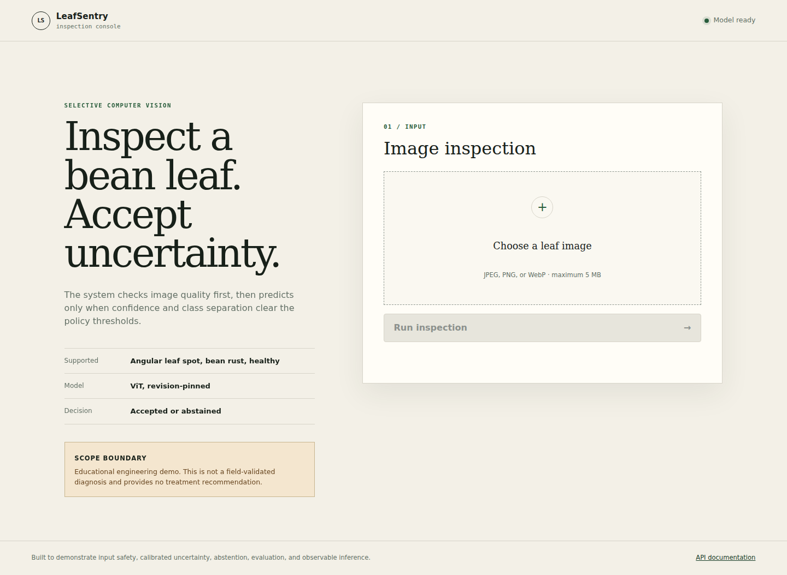
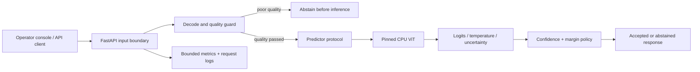

# LeafSentry AI

[](https://github.com/sadisad/leafsentry-ai/actions/workflows/ci.yml)
[](https://github.com/sadisad/leafsentry-ai/actions/workflows/codeql.yml)

A bean-leaf image-triage service that can abstain. Upload an image, inspect its quality, and receive a versioned decision with confidence, class separation, entropy, and an auditable policy trace.

**Educational decision-support demo; this is not a field-validated diagnosis.**



The screenshot above uses a deterministic test predictor. It demonstrates the interface, not model performance. The production backend uses a pinned Vision Transformer; its measured outputs are recorded separately in [evaluation evidence](docs/evaluation/README.md).

## Measured evidence

The pinned pretrained model reproduced **96.875% top-1 accuracy on 128 upstream test images**. At the default score policy, coverage was **99.219%**, accepted-set accuracy **97.638%**, and accepted-set risk **2.362%**. This is model-level evidence, not field performance or end-to-end image-quality coverage. [Full report and failure analysis](docs/evaluation/README.md).

## What this project demonstrates

This is the system around a pretrained model, not a claim of a new model or training method. The engineering work covers:

- An untrusted-image boundary: byte, format, pixel and dimension limits, EXIF orientation, complete decoding, and quality heuristics before inference.
- Explicit uncertainty: temperature-scaled softmax, top-two margin, normalized entropy, and an accepted/abstained policy. The default temperature is 1.0; no fitted calibration is claimed.
- A FastAPI contract with safe errors, request correlation, independent liveness/readiness, and Prometheus metrics with bounded labels.
- CPU inference behind a predictor protocol. Normal tests inject deterministic predictors; real weights are exercised separately.
- Reproducible evaluation, a non-root container, locked dependencies, SHA-pinned Actions, security checks, and installable Python distributions.

Supported classes are `angular_leaf_spot`, `bean_rust`, and `healthy`. The system does **not** detect whether a photo is actually a bean leaf, reject every out-of-distribution image, diagnose other crops, or recommend treatment.

## Run locally

Python 3.11 or 3.12 and [uv](https://docs.astral.sh/uv/) are required. The verified ML runtime is Linux x86-64 CPU.

```bash
git clone https://github.com/sadisad/leafsentry-ai.git
cd leafsentry-ai
uv sync --frozen --extra ml
uv run --no-sync leafsentry-api
```

Open `http://127.0.0.1:8000`. API reference: `/docs`; machine-readable schema: `/openapi.json`.

The first valid, quality-passing upload downloads about 343 MB of pinned model weights. Before that first inference, `/health/ready` correctly returns 503; `/health/live` returns 200 without loading weights. A working Internet connection is needed for the initial download. Subsequent predictions reuse the local model and cache.

For a loopback-only container:

```bash
docker compose up --build
```

The container runs as UID 10001 with a read-only root filesystem, dropped capabilities, a writable model-cache volume, and a temporary filesystem. No GPU is required. See [operations](docs/OPERATIONS.md) before exposing the service publicly; the app has no authentication or built-in rate limiter.

## Inspect through the API

```bash
curl --fail-with-body   -H 'X-Request-ID: portfolio-demo'   -F 'file=@leaf.jpg;type=image/jpeg'   http://127.0.0.1:8000/v1/predictions
```

Both accepted and abstained decisions return HTTP 200. An abstained response has `prediction: null` and machine-readable reasons. Poor image quality skips model inference entirely. Invalid, unsupported, oversized, or unavailable-model requests use 4xx/503 responses.

Images are not retained by application code. Multipart parsing can use temporary spooled files, which are closed after the request. Do not upload private or identifying imagery to an untrusted deployment.

## Architecture and trade-offs



A stateless modular monolith keeps HTTP, model loading, decision policy, and evaluation separable. Inference is serialized per process in a worker thread so lazy loading is not raced and CPU work does not block health requests. This favors predictable resource use over throughput; it is not a high-volume inference server.

The model and dataset revisions are immutable source pins. Runtime environment overrides only operational thresholds. Confidence and margin defaults are author-selected demonstration settings, not field-validated safety thresholds. A test-set threshold sweep is descriptive analysis, not a basis for choosing production thresholds.

## Reproduce the evidence

```bash
# Fast, network-free application tests; no model weights are downloaded
uv sync --frozen --extra dev --no-install-project
make verify

# Reinstall ML extras and exercise the real pinned model
uv sync --frozen --extra dev --extra ml --no-install-project
make model-smoke

# Download the immutable held-out test archive (128 images)
mkdir -p .cache/dataset-eval
curl --fail --location --retry 3   https://huggingface.co/datasets/AI-Lab-Makerere/beans/resolve/27aa014ce09b193e1a6f58112d4a66e0eddb69c5/data/test.zip   --output .cache/dataset-eval/test.zip
make benchmark

# Evaluate your own JSONL probabilities
PYTHONPATH=src uv run --no-sync python -c   'from leafsentry.cli import main; main()'   evaluate examples/predictions.example.jsonl
```

The benchmark validates the archive SHA-256, expected sample count, class names, and archive paths. It records top-1 accuracy, macro-F1, NLL, Brier score, ECE, selective coverage/risk, confusion matrix, and a threshold sweep. It evaluates the **model and score policy**, not end-to-end image-quality gating or an independent field dataset.

Normal CI checks Python 3.11/3.12, formatting, lint, strict typing, coverage (minimum 90%), clean wheel installation, container build, and dependency security. The manual [pinned model evaluation workflow](.github/workflows/model-evaluation.yml) produces smoke or held-out-test JSON artifacts. CI never needs a GPU.

## Evidence, limitations, and ownership

Read [evaluation results](docs/evaluation/README.md), [model/system card](MODEL_CARD.md), [security boundary](SECURITY.md), and [operations runbook](docs/OPERATIONS.md). The [case study](docs/CASE_STUDY.md) explains the engineering decisions and what remains unvalidated.

The weights are from [nateraw/vit-base-beans](https://huggingface.co/nateraw/vit-base-beans), not trained by this project. Dataset: [AI-Lab-Makerere/beans](https://huggingface.co/datasets/AI-Lab-Makerere/beans). Code is Apache-2.0; upstream model metadata declares Apache-2.0 and dataset metadata declares MIT. No dataset or weights are redistributed here.

Built by [Irsyad Dzulfikar](https://github.com/sadisad). [Contributing](CONTRIBUTING.md).
