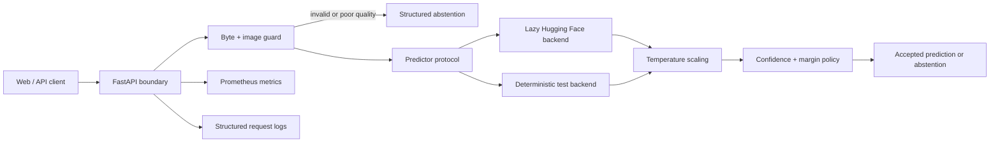

# LeafSentry AI — System Design

## Product intent

LeafSentry AI is a portfolio-grade, production-oriented image triage service for bean leaves. It demonstrates the work around a model that matters in real systems: input safety, image-quality checks, uncertainty measurement, selective prediction, stable API contracts, observability, evaluation, containerization, and automated verification.

It is intentionally narrow. The initial model recognizes only `angular_leaf_spot`, `bean_rust`, and `healthy`. The service must abstain rather than force a label when input quality is poor or confidence is insufficient. It is an educational decision-support demo, not a field-validated diagnostic device.

## Evidence boundary

Default model: `nateraw/vit-base-beans`, pinned to revision `41f85ace09a4613c2c65495b3b8465c4ceee1d00`.

- Model card license: Apache-2.0.
- Dataset: `AI-Lab-Makerere/beans`, license marked MIT on its dataset card.
- Dataset scope: 1,295 bean-leaf images across train/validation/test and three labels.
- The upstream model card reports a Hugging Face-verified test accuracy of 0.9453125. LeafSentry does not present this as its own result.
- Any LeafSentry metric must come from a checked-in reproducible evaluation artifact and identify the model revision, dataset revision, split, configuration, and timestamp.

## Architecture

### Request path

1. Read at most `max_upload_bytes + 1`; reject oversized payloads before image decoding.
2. Verify the media type and the decoded image format; do not trust the filename.
3. Apply EXIF orientation, convert to RGB, and enforce dimension/pixel limits.
4. Measure brightness, contrast, and edge variance. Any failed quality heuristic abstains before inference.
5. Run a predictor through a small protocol so tests never need model weights.
6. Convert logits to probabilities with a positive temperature.
7. Return the top classes, normalized entropy, confidence, and top-two margin.
8. Abstain if confidence or margin fails policy. Never invent treatment advice.
9. Record bounded metrics without filenames, image bytes, or request IDs as labels.

## Components

- `config.py`: immutable environment-backed settings and model identity.
- `schemas.py`: versioned API and internal domain models.
- `image_guard.py`: safe decoding, resource limits, EXIF normalization, and deterministic quality signals.
- `prediction.py`: predictor protocol, temperature-scaled softmax, uncertainty, and abstention policy.
- `backends/huggingface.py`: lazy optional Transformers/PyTorch adapter, pinned revision, no remote code.
- `service.py`: orchestration independent of HTTP.
- `api.py`: app factory, upload boundary, health endpoints, errors, request IDs, metrics, and demo assets.
- `evaluation.py` and `cli.py`: accuracy, macro F1, NLL, Brier score, ECE, coverage, selective accuracy/risk, and threshold sweeps from JSONL predictions.
- `static/`: one-screen operator demo focused on upload, decision, uncertainty, and limitations.

## API contract

`POST /v1/predictions` accepts one image multipart field named `file`.

Success is HTTP 200 for both accepted and abstained decisions. The response includes:

- contract version and request ID;
- `decision`: `accepted` or `abstained`;
- top prediction only when accepted;
- confidence, margin, normalized entropy, and top-k scores when inference ran;
- image quality measurements and findings;
- machine-readable abstention reasons;
- exact model ID/revision and policy thresholds;
- latency and a non-diagnostic disclaimer.

Malformed, unsupported, or oversized uploads are HTTP 4xx. An unavailable model is HTTP 503. Unexpected internals are HTTP 500 with no stack trace or sensitive detail in the response.

## Error and safety posture

- Application code does not retain uploads. Multipart parsing may spool bytes to temporary disk; uploads are closed after each request.
- Decompression bombs, extreme dimensions, unsupported formats, empty files, and content-type mismatches are rejected.
- The model loads lazily so liveness is distinct from readiness.
- Readiness reports unavailable until the predictor is ready; test/demo injection can be immediately ready.
- No treatment recommendations, location claims, or unsupported crop coverage.
- No dynamic remote code, pickle uploads, user-provided model IDs, or arbitrary URLs.
- Public deployment still requires reverse-proxy rate limits and TLS; these are documented rather than faked in application code.

## Testing strategy

- Unit: configuration, safe decode boundaries, quality gates, stable softmax, entropy, abstention, evaluation metrics.
- Contract: API accepted, abstained, invalid, oversized, readiness, and metrics paths using an injected predictor.
- Property checks: probabilities are finite, non-negative, and sum to one; temperature must be positive.
- Integration: real pinned model loads and classifies the three upstream sample images. This test is explicitly marked `model` and excluded from normal CI.
- Packaging: install wheel in a clean virtual environment and import the app.
- Container: build, run as a non-root user, probe health, and exercise an invalid upload without downloading arbitrary assets.

## UI direction

Primary surface: **Operate**. The interface is an inspection console, not a marketing hero. The upload action, current model state, decision, uncertainty, and limitations dominate. Visual language uses soil/leaf neutrals with one safety accent, compact hierarchy, no fake statistics, no stock imagery, and responsive keyboard-accessible controls.

## Success criteria

- Every behavior has a test that failed before implementation.
- Normal CI needs no model download and no GPU.
- A separately executed real-model smoke test proves the optional backend against pinned upstream images.
- Unit/contract tests, lint, formatting, type checks, package build, Docker smoke, and secret/dependency scans pass from fresh commands.
- GitHub repository is public, documented, licensed, topic-tagged, and linked from the profile README.
- README distinguishes upstream claims, reproduced evidence, limitations, and untested field performance.
